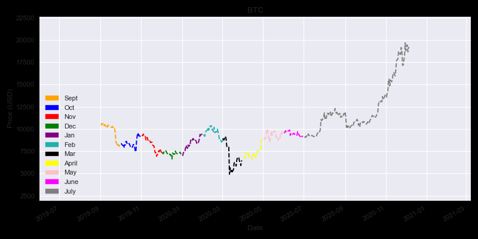

<h1>Crypto currency plots</h1>

## Purpose
The purpose of this notebook is to see the correlations between different crypto currencies using a heatmap, and checking the returns using statistical methods. 

## Methodology
Crypto currencies tend to be heavily correlated, especially alt-coins. When bitcoin is performing well or has an aggressive move, alt-coins tend to underperform.

## WIP - improvements
 
Notable TODOs:
- Clean up code so execution time is faster
- ~Make March plot~
- Use mask to clean up heatmap.

# Setup
##### Virtual environment
'''
python3 -m venv venv
source venv/bin/activate
'''
#### Packages
'''
pip install pandas
pip install numpy
pip install matplotlib
pip install seaborn
pip install scipy
'''

## Library import
We import all the required Python libraries
# API Calls
import requests

# Data manipulation
import pandas as pd
import numpy as np

# Visualizations
import matplotlib.pyplot as plt
import seaborn as sns

# Statistics
import scipy

# Data import
We retrieve all the required data for the analysis using requests.

url = "https://min-api.cryptocompare.com/data/histoday?fsym=BTC&tsym=USD&limit=10&e=Coinbase"

f = requests.get(url)
